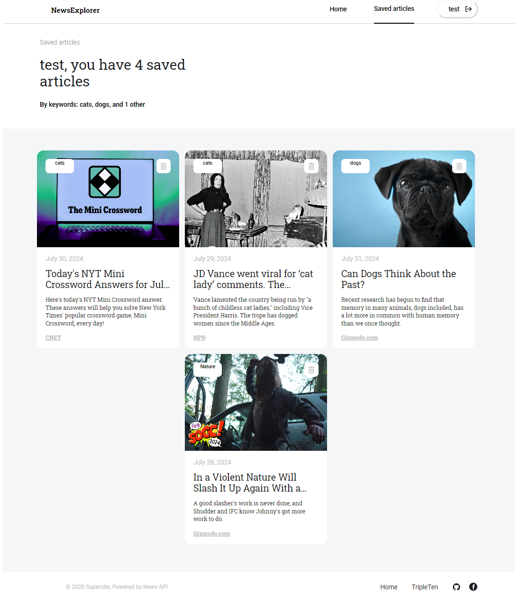

# Project: NewsExplorer APP (React + Vite + Node.js + express.js + Mongod)

<a href="https://news-explorer-frontend.vercel.app" target="blank">newsexplorer</a>

## GitHub Repository link https://github.com/flysputnik17/news_explorer_frontend.git

## Backend link https://github.com/flysputnik17/news_explorer_backend.git

**Figma**

- [Link to the project on Figma](https://www.figma.com/design/3ottwMEhlBt95Dbn8dw1NH/Your-Final-Project?node-id=0-1&t=BHHlQaTgyMISbXrh-0)

**Images**  

